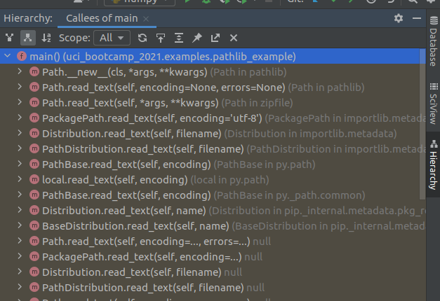

# Advanced features: Call Graphs

So far we have only shown off basic features an IDE has to offer, and only shown small amounts of code.

To be more representative of challenges programmers can face, its necessary to show more complicated
projects.

I will use one of my open-source codebases, [Pipsqueak3](https://github.com/theunkn0wn1/pipsqueak3) to
demonstrate some of the more advanced features an IDE can offer.

- The exact codebase is of no relevance to Data Science, and was selected due to the author's
  familiarity with it.

For sake of example, let's take the `Context` class this package defines, and look
at [`Context.reply`](https://github.com/theunkn0wn1/pipsqueak3/blob/develop/src/packages/context/context.py#L115)

## Getting a list of everything that calls this function
```python
# https://github.com/theunkn0wn1/pipsqueak3/blob/develop/src/packages/context/context.py#L115
# including the copyright notice as per BSD 3-clause.
"""
Copyright (c) 2018 The Fuel Rat Mischief,
All rights reserved.
Licensed under the BSD 3-Clause License.
See LICENSE.md
"""


class Context:
    ...

    async def reply(self, msg: str):
        """
        Sends a message in the same channel or query window as the command was sent.
        Arguments:
            msg (str): Message to send.
        """
        if self.channel is not None:
            await self.bot.message(self.channel, msg)
        else:
            await self.bot.message(self.user.nickname, msg)
```

Say we want to know everywhere this method is called. How can we do that?

We could probably do a text search, but that may return irrelevant results.

We don't need to do that, because PyCharm' static analysis features extends to code structure!

By placing the cursor over the method and pressing the `Control Heiarchy` key (or activating in the
context menu), we can access the information our IDE has about this method!


## Getting the list of everything this function calls.
By default, the Hierarchy view shows what calls the function. Sometimes its useful to have the opposite information: what does this function call.

"Can't you read the code to determine that?" Good guess but actually no.
Reading the code only shows *direct* calls - the stuff the code directly names.

If we invert our above structural filter to show callees and loosen the scope to all:


> The Yellow highlight here indicates library code.