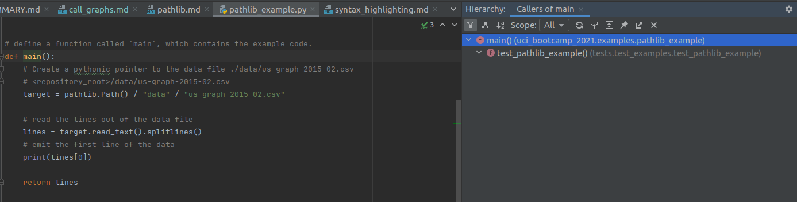
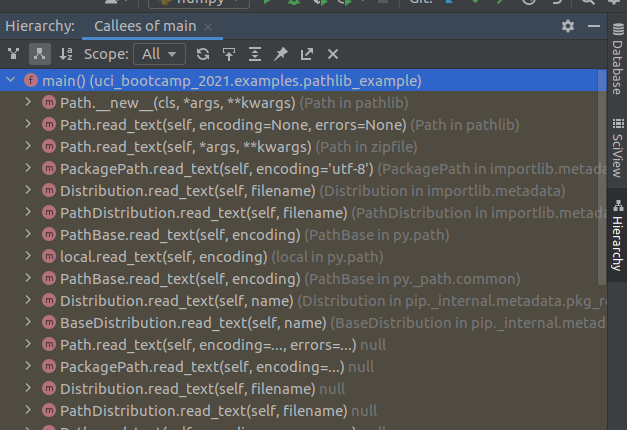

# Advanced features: Call Graphs

So far we have only shown off basic features an IDE has to offer, and only shown small amounts of code.

To be more representative of challenges programmers can face, its necessary to show more complicated
projects.

I will use one of the examples out of the Python presentation, which shares the same source repository.
See [Pathlib](../../python/pathlib.md) for an explanation of what this piece of code is doing.

```python
{{ #include ../../../uci_bootcamp_2021/examples/pathlib_example.py:6:20}}
```

## Getting a list of everything that calls this function

Say we want to know everywhere this function is called. How can we do that?

We could probably do a text search, but that will return irrelevant results.

We don't need to do that, because PyCharm' static analysis features extends to code structure!

By placing the cursor over the method and pressing the `Code Heiarchy` key (or activating in the
context menu), we can access the information our IDE has about this method!


 - There is only one place that calls this function within the repository: within a test!
## Getting the list of everything this function calls.

By default, the Hierarchy view shows what calls the function. Sometimes its useful to have the opposite
information: what does this function call.

"Can't you read the code to determine that?" Good guess but actually no. Reading the code only shows *
direct* calls - the stuff the code directly names.

If we invert our above structural filter to show callees and loosen the scope to all:

> The Yellow highlight here indicates library code.