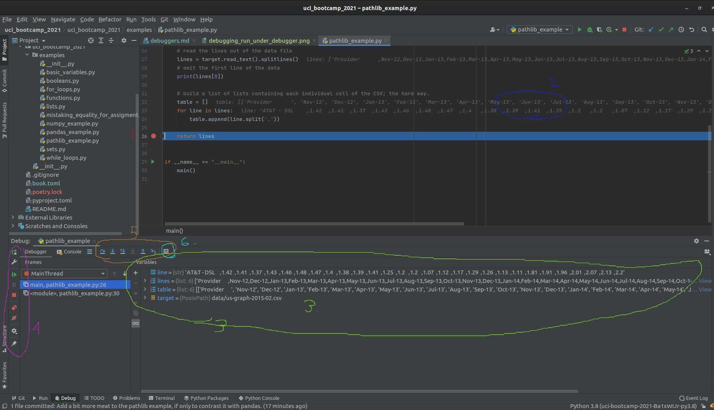

# Debuggers

As you write more and more complex code, it is often times necessary to emit diagnostic information in
the middle of the program.

For instance, you might want to spot-check the algorithm by emiting an intermediate result from a
larger computation. Another case is in a large server application, and something is not behaving as
anticipated, so you need to know what the program thinks its doing.

> Computers arn't smart: they do exactly what we tell them to do, not what we intended to tell them to do.

## Methods of debugging: logging

A common strategy to diagnosing misbehaving code is to add diagnostic output. In other words, modifying
the source code of the program to emit *logging* messages.

> Side note: in simple cases `print` / `std::cout <<` / `System.out.println` / etc are usable; but suffer from two key flaws:
>  1. Not every type can be trivially cast to a string and printed.
>  2. Once debugging is complete and the bug is fixed; all of that output has to be removed.
>
> The best practice when adding logging to a project, is to use a *logging framework*.

## Methods of debugging: attaching a debugger

The logging method requires source code modification, which is quite unwieldy. It becomes infeasable
when the bug is either non-trivial or otherwise expensive to reproduce.

- Debuggers require **no code modification**, and can frequently be attached to running programs.
- They can inspect the memory of the process, revealing what the program is actually doing.
- Limited code execution features

Debuggers can be extremely powerful once mastered.

Of course, an IDE's debugger window can be daunting to look at to the untrained eye. This page aims to
demystify the Jetbrain's PyCharm Debugger.

> Side Note: Most of the debugger concepts translate both to other IDEs in the Jetbrains family, and to other unrelated IDEs.

## Debugging a program in PyCharm

The first thing you need to debug a script written in Python, using PyCharm, is a [run configuration]()
.

For this page, we will be using the [pathlib example](../python/pathlib.md) run config established in
the [run configurations]() section.

The second thing necessary to using a debugger is to know at what point in the program you want to
pause it for inspection. This location more commonly known as a `breakpoint`.

- While you *can* step through a program one instruction at a time, doing so would be horribly slow and
  inefficient.

For example, let's place a breakpoint on the line that the main function returns, so we can inspect the
final state of the function before its state falls out of scope.

To achieve this, we click in the gutter on line 26.

- The area in the code editor window between the code itself is known as the "gutter"
  

Two things are immediately visible as a result of this:

1. The place we clicked is filled in with a red circle, indicating the line has a breakpoint
   registered.
2. The entire line receives a red highlight, indicating that line has a breakpoint on it.

> You can set an arbitrary number of breakpoints.
> A breakpoint triggers when the marked line is reached, BEFORE it executes.

### The Debugging view

Now that we have a run configuration, and we have set a breakpoint, we can run the example under the
debugger. At the top right of the PyCharm window, right next to the `pathlib_example` dropdown there
are 5 different run buttons. Five!

Not to worry, as each one has a specifc job, and the one we want looks like a squashed bug. Second from
the left. Circled Red.

After being pressed, PyC automatically opens the editor window for the `pathlib_example.py`. You may
notice there is some extra information rendered over the source file now. It also opens up the debugger
window and shows some information.

> The debugger window may seem daunting at first, but don't let it intimidate you!

Let's break this down, one view at a time. Starting with the code view:

1. The line the program hit the breakpoint on is now highlighted in blue, replacing the red highlight.
2. The value of variables is rendered as overlay to the right of the code.
    - This overlay can be useful when the variables are of simple types or only house a small amount of
      data.
3. Moving on to the debugger window, we see a view of all variables that are in scope.
    - From here we can directly observe the value of every variable
4. We also have some basic controls on the far left of the window, which control (in order):
    - Restarting the program
    - Shortcut to editing the run configuration
    - Resuming the program
    - Halting the program (used only sparingly; prefer to use breakpoints!)
    - Button to view all breakpoints
    - Button to "mute" breakpoints
    - Debugger settings
    - Pin view
5. More advanced debugger controls
    - Show execution point (opens current breakpoint in code editor and brings to foreground)
    - "step over" - run until the next line of code *in the current function* is reached, ignoring
      library code."
    - "step into" - step into the next line of code executed even if its in a differnt module.
    - "step into my code" - step until the next line of *project* code is executed, ignoring library
      code.
    - "force step into" - more agressive "step into"
    - "step out"  - run until the current function returns, then break.
    - "run to cursor" - Does what it says on the tin.
6. "Evaluate expression" - super useful, allows you to run a small amount of code in the current
   breakpoint context. So useful its specifically called out here!

## Bottom line

The debugger is an incredibly powerful piece of software.

Using it can greatly improve the debuggability of code and make the debugging experience more
pleasurable.

The biggest challenge to learning how to use the debugger is getting over the hurdle that is the sheer
amount of information that is presented at once.

Aside, everything done in PyCharm's debugger *can* be done via the command line, but it is far less
easy or intuitive to work with.

## Further reading
[Official documentation](https://www.jetbrains.com/help/pycharm/debugging-code.html)