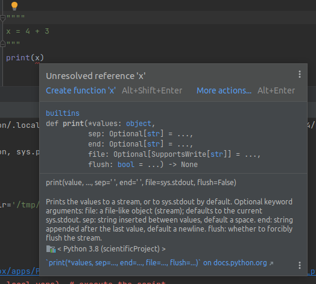

# Error Detection

Another feature of a *good* code editing environment is the ability for the IDE to detect errors as
they are introduced.

In the previous slide, PyCharm actually did highlight the error in two different ways:

- Syntax highlighting: the variable declaration was the wrong color
- In the call site of `print`, where the variable that wasn't declared was used.



PyCharm told us exactly what went wrong, before we ran the code!

> Static Analysis is a property of a development tool to read the source code and check it for errors,
> WITHOUT running the code.

This can be valuable, especially when the program involves expensive computations, or the exact branch
is difficult to trigger.

- Not all errors can be detected this way, but a large amount can be.

## Remediating errors.

Let's use a more concrete example for this.

As data scientists, we are likely to work with libraries like [Pandas](../python/pandas/dataframe.md).

Sometimes we may even forget to [import](../python/import_this.md) the library before attempting to use
it!.

For example:

```python
df = pandas.DataFrame()
```

If we ran this as-is, it will fail since `pandas` isn't in scope!


PyCharm recognizes this, as it is always statically analyzing the code.

In this case, it even offers a solution:


> An IDE cannot fix every conceivable error it may detect. As always: use your best judgement before applying fixes. 