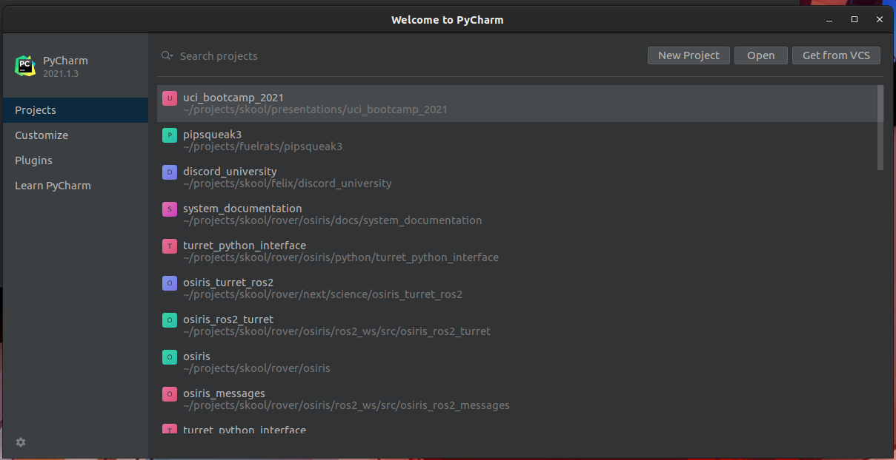
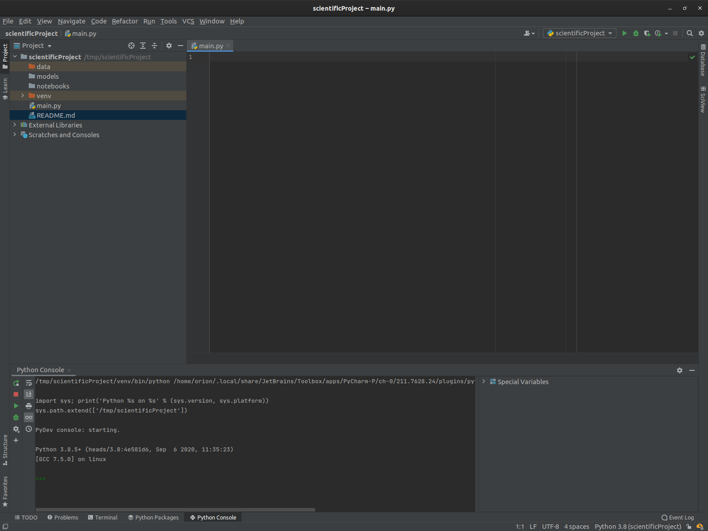

# PyCharm

For this presentation, I will be presenting using one set of IDEs made by the company Jetbrains.

Specifically, I will be using [PyCharm](https://www.jetbrains.com/pycharm/), which is their Python IDE.

This is a professional grade IDE, which you can
get [for free.](https://www.jetbrains.com/community/education/)

## Quick Start

When you open PyCharm up for the first time, you will encounter a screen that looks like this:

If you haven't done anything with the IDe yet, your projects view will likely be empty.

Pycharm offers sane defaults for a range of application types. When creating a python project, it will
even create a [virtual environment]()  for you.

## Anatomy of the IDE windows

- Pycharm spawns in one window by default, and includes several "tabs"

- The left tab is the "project" view: it corresponds to the filesystem structure of the project.
- the bottom tab has multiple views, in this case the [Python console](../../python/hello_world.md).
- Other tabs exist, such as the `Terminal` window which gives access to the OS shell, and even some
  language-specific features.
- There are also tabs that only show up in certain contexts, such as the [debugger]() window.