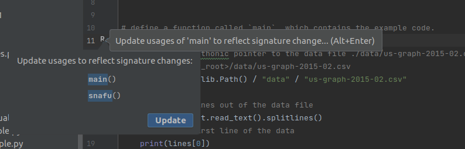
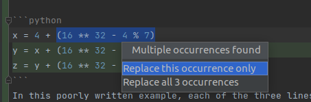

# Refactoring

As the size of code grows, so does the understanding of the developer. What may have made sense at the
start of the project may suddenly not work quite as well halfway in.

Sometimes functions simply need to be moved into a new module for better organization, or a repeated
operation simplified into a variable. Sometimes Entire superclasses can be extracted to better
represent the code structure.

These are all examples of `refactoring`
> Refactor: To rewrite existing source code in order to improve its readability, reusability and/or structure, without changing the behavior of the code.


Let's take this presentation, for example!

At the time of writing, the IDE documents are full of images, which are included in the rendered
documents.

Initially, all of the images sat at the same level as the source `.md` documents they are included in,
which are all in the same `src/ide` folder. This proved itself unwieldy, as the file structure is not
conducive to a viewer's understanding of what documents import which image files.

## Renaming and moving files

One mode of refactoring is to move files from one directory to another.

> "Why does the IDE need to support this? can't you just move it in the OSes file browser?"
Well no, because the files are referenced by *other files*. Moving a file without modifying its uses will break those uses.

Pycharm supports many forms of refactoring which are valid in different contexts. In this specific
case, files can be moved via the projects window.

From the context menu (right-click on the file), select refactor>move

- PyCharm will automatically update all references to the file to point to the new location.

## Renaming functions in code

Renaming and moving files is one thing, but its hardly impressive. Let's do something a bit more
involved: renaming a [function!](../../python/functions.md)

Once more we call back to the [Pathlib example](../../python/pathlib.md)

If we recall the source code of this example, we will see there is a function defined here!.

```python
# uci_bootcamp_2021/examples/pathlib_example.py
{{  #include ../../../uci_bootcamp_2021/examples/pathlib_example.py:6:20}}
```

If we recall from
the [Call Graphs](../call_graphs/call_graphs.md#getting-a-list-of-everything-that-calls-this-function)
section, an entirely different module calls this function!

If we were to rename this function *without* refactoring; the test suite will fail.

Fun fact: Pycharm is smart enough to ask you if you want to refactor if you manually edit a function
name!


Anyways, if we ignored this warning for the sake of demonstration we can observe the [test suite]()
failing.


- This demonstrates that renaming things requires a bit more effort than changing the definition.

However, if we used the `refactor | rename` feature, all of the usages will be updated and the tests
will pass.

## Extracting variables

The last of the major refactoring features that we will show here is the `Refactor | Extract Variable`

Take the following code fragment for example:

```python
x = 4 + (16 ** 32 - 4 % 7)
y = x + (16 ** 32 - 4 % 7)
z = y + (16 ** 32 - 4 % 7)
```
In this poorly written example, each of the three lines repeats a comparatively expensive operation needlessly.

To make this code simpler, we can do one of two things:

1. Manually introduce a variable and update all three lines of code to use that variable
2. Or we can ask PyCharm to do it for us via the `Refactor | Extract Variable feature.`


```python
expensive = (16 ** 32 - 4 % 7)
x = 4 + expensive
y = x + expensive
z = y + expensive
```
# Further reading:

[Move Refactorings official docs](https://www.jetbrains.com/help/pycharm/move-refactorings.html)