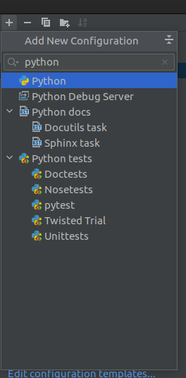

# Run configurations

An IDE integrates with various tools. It can even run your code.

A "run configuration" is how we instruct our IDE what we want to run and how.

## Running a Python script

In the "Create/edit run configurations window", the user can create run configurations for a great many
tools and modes.

One of these modes is the "python" template.

> Usability note: Just like with code completion in the editor window, you can type into the "New configuration" dropdown menu to filter!
c

Once the Python run configuration has been created, some details need to be filled in for it to take
effect.

Specifically, the `Script Path` field needs to be filled in, pointing at the file you want to run

- Note: `Script Path` is a drop down, and `Module name` can also be selected. The former
  does `python {{Script Path}}, the latter does `python -m {{Module Name}}`

- the working directory should also be set, or the module may behave unpredictably when handling file
  paths.

## Platform specific tooling: pytest

There is a plethora of templates available, including for platform specific tools:

- Test framework integrations
- Scientific Python integrations
- Flask/Django integrations
- Documentation generators like Sphinx and Javadoc
- Docker
- etc.

## Further reading

[Official documentation](https://www.jetbrains.com/help/pycharm/run-debug-configuration.html)