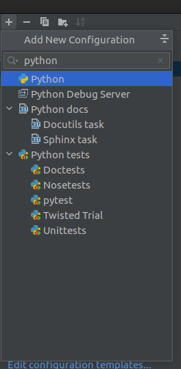
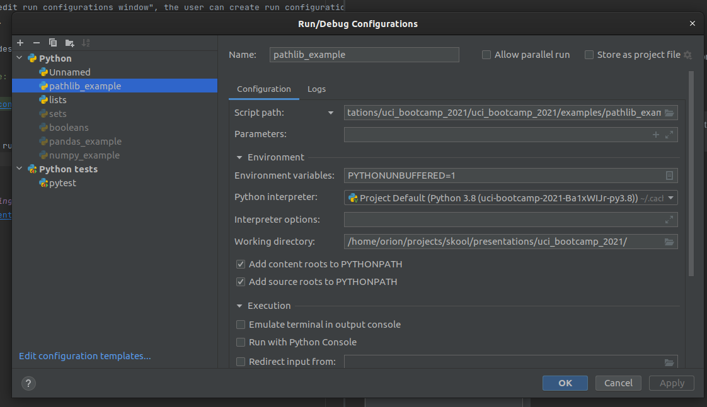

# Run configurations

An IDE integrates with various tools. It can even run your code.

A "run configuration" is how we instruct our IDE what we want to run and how.

## Running a Python script

In the "Create/edit run configurations window", the user can create run configurations for a great many
tools and modes.

One of these modes is the "python" template.

> Usability note: Just like with code completion in the editor window, you can type into the "New configuration" dropdown menu to filter!

Once the Python run configuration has been created, some details need to be filled in for it to take
effect.

Specifically, the `Script Path` field needs to be filled in, pointing at the file you want to run

- Note: `Script Path` is a drop down, and `Module name` can also be selected. The former
  does `python {{Script Path}}, the latter does `python -m {{Module Name}}`

- the working directory should also be set, or the module may behave unpredictably when handling file
  paths.

## Platform specific tooling: pytest

There is a plethora of templates available, including for platform specific tools:

- Test framework integrations
- Scientific Python integrations
- Flask/Django integrations
- Documentation generators like Sphinx and Javadoc
- Docker
- etc.

## Further reading

[Official documentation](https://www.jetbrains.com/help/pycharm/run-debug-configuration.html)