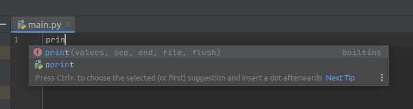
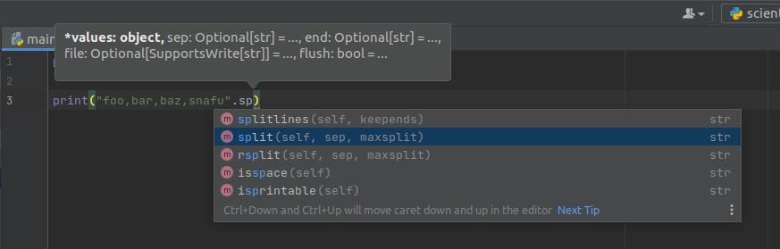
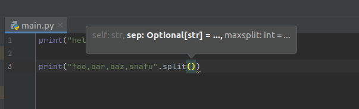

# Syntax highlighting and Code completion

Now that we have an editor window, we should write some code!

Classically, the jumping off point is [hello-world](../python/hello_world.md)

As we start typing into the `main.py` provided to us, a window pops up.


This is one of an IDEs central features: Code completion!

## Code Completion

Basically, the IDE has enough intellegence to figure out what you're trying to do, and offer to help
you with it. If you press <tab> here, PyCharm will automatically fill in the rest of the function call
for you!

> The IDE knows what is valid and what is not; if the name of the variable/function/method isn't completing; you've probably gotten something wrong writing the code!

Here is a slightly longer example that demonstrates how this can be useful a bit more clearly:

Say we have an string of values out of a CSV, `foo,bar,baz,snafu` and we want to split them up so we
can process each value seperately. We happen to know that strings have
a [str.split](https://docs.python.org/3/library/stdtypes.html#str.split) method that gets the job done,
so we start typing that:

> (For more information about Python, please attend my second presentation, where I give [A crash course in Python for Computer Science]())

```python
print("foo,bar,baz,snafu".split(','))
```



Here, PyCharm clearly understands what kind of objects it has to work with, as well as what operations
are valid on them.


To keep these documents and this presentation concise, some details have been omitted. For further
reading, please consider reading
over [PyCharm's user manual](https://www.jetbrains.com/help/pycharm/using-code-editor.html)

## Syntax Highlighting

Syntax highlighting can show, at a glance, if a piece of code is valid syntax and, once you get used to
the colors, if the structure looks right.

> If your code isn't highlighting the way you expect, something is written incorrectly.

- In this example, x is highlighted as if it is a [string](../python/comments.md#string-literals)!
    - it is a string, which is clearly incorrect and is why the code fails to run.
    - At a glance, the programmer can spot this error, regardless of other tools.
