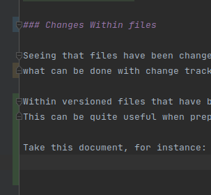
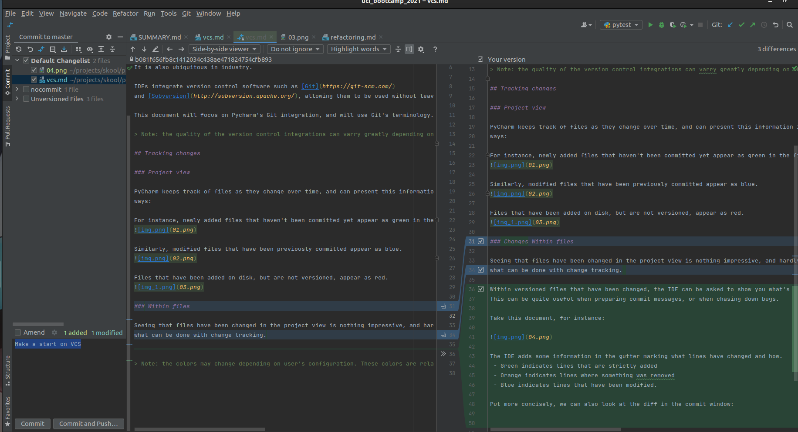

# Version Control

It is best practice to use [Version Control](https://git-scm.com/video/what-is-version-control) as
software is written.

It is also ubiquitous in industry.

IDEs integrate version control software such as [Git](https://git-scm.com/)
and [Subversion](http://subversion.apache.org/), allowing them to be used without leaving the IDE.

This document will focus on Pycharm's Git integration, and will use Git's terminology.

> Note: the quality of the version control integrations can varry greatly depending on what development environment you choose. It is recommended to learn how your specific IDE/Code Editor behaves.

## Tracking changes

### Project view

PyCharm keeps track of files as they change over time, and can present this information in several
ways:

For instance, newly added files that haven't been committed yet appear as green in the file browser.

Similarly, modified files that have been previously committed appear as blue.

Files that have been added on disk, but are not versioned, appear as red.

### Changes Within files

Seeing that files have been changed in the project view is nothing impressive, and hardly represents
what can be done with change tracking. 

Within versioned files that have been changed, the IDE can be asked to show you what's changed.
This can be quite useful when preparing commit messages, or when chasing down bugs.

Take this document, for instance:

The IDE adds some information in the gutter marking what lines have changed and how.
 - Green indicates lines that are strictly added
 - Orange indicates lines where something was removed
 - Blue indicates lines that have been modified.

Put more concisely, we can also look at the diff in the commit window:

> Note: the colors may change depending on user's configuration. These colors are relative to the `Dracula` theme.
