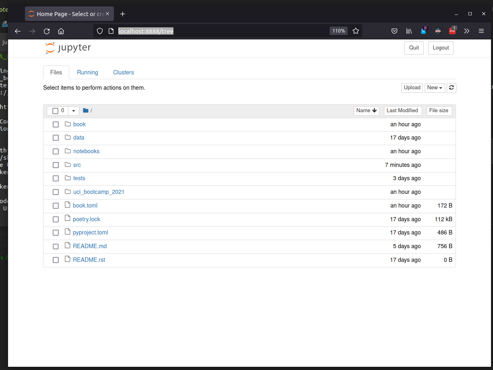

# Jupyer Notebook

[Jupyter Notebook]() is one of the core scientific tools. It, effectively, combines the expressive
power of [IPython](ipython.md) with the utility of a Web browser.

The best way to show the notebook's capabilities is to showcase them.

## launching the Jupyter notebook server

```bash
# from the CLI
jupyter notebook
```

This should launch the notebook server, and automatically open its web portal in your default browser.

Launching the notebook server in the root of this document's repository should greet you with a screen
that looks like this:


## Creating and using notebooks

near the top right there is a "new" button, which produces a drop-down box. in that box select "
python3".

## Using the notebook

Code and text are split up into "cells", which evaluate sequentially. All cells are code cells by
default, but may be switched to [markdown](https://daringfireball.net/projects/markdown/) cells as
required to annotate the notebook.

The notebook has special integrations for the Scientific Python stack, including custom renders
for `matplotlib` plots and `pandas` dataframes.

