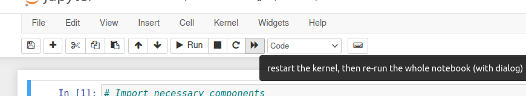

# Cells can evaluate out of order

One common pitfall of the notebook is that it is **stateful**. Once a cell is executed, its value
remains until it is re-evaluated. This can lead to **unreproducible** notebooks if due care is not
taken.

Notebooks frequently contain multiple cells, often describing the *sequential* steps taken to process
some data. However, as the data is being explored, the data scientist may edit *earlier* cells to fix
an error or modify the data format.

*doing this produces an inconsitent state, as the notebook is not re-evaluated when a single cell is
modified*. This can result in the notebook being **unreproducible**, as some cells may have been
computed on data that no-longer exists.

## The workaround

Whenever the data scientist modifies a code cell, they should manually re-evalute the entire notebook.
This ensures that the cells always have valid and reproducible data in them.

