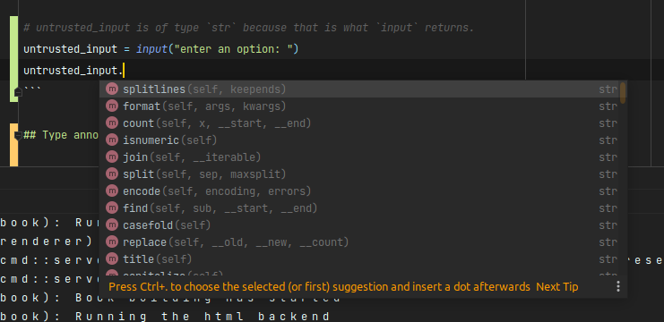

# Types

Computers frequently handle different kinds of data.

similar to how there are different *types* of fruits, and different *models* of automobiles, there are
different *types* of data that computers process.

## Noteworthy types

| type | description | example |
 -------| ---------| ------- 
| `str` | a string of text. In modern Python all strings are [`unicode`](https://en.wikipedia.org/wiki/Unicode) | `"I like pizza"`
| `bytes` | representation of an arbitrary stream of bytes. Frequently returned from low-level communication library calls. | `b'\xde\xad\xbe\xef'` |
| `int` | Integers, may be positive or negative. In modern python, they may be of arbitrary size. | `42` |
| `float` | Decimal numbers, represented as [floating point](https://www.eng.auburn.edu/~nelsovp/courses/elec5200_6200/ELEC5200_6200%20Chapter%203%20Float.pdf) values | `0.75` |
| `None` | The lack of a value; roughly comparable to `NULL` in the C-like languages. | `None` |
| `bool` | Boolean values. Something that is either `True` or `False`. | `True`, `False` |
| `list` | Ordered collection of heterogeneous data. see [lists](basic_containers/lists.md) | `[2,1,3,4]`
| `dict` | Key-value pairs of heterogeneous. see [dict](basic_containers/lists.md) |  `{ 2: 'foo', 1: 'bar'}`
| `set` | unordered collection of heterogeneous data. see [sets](basic_containers/sets.md) |  `{ 1, 2, 3}`, `{(1, 2), (1, 3), (4, 2)}`

## How do we use types?

- Every expression in Python has a type
- Types can typically be determined statically
- Types allow your IDE/Editor to provide static-analysis features

```python
# x is of type `int` because it is the result of adding two `int` literals together.
x = 4 + 3
# y is of type `float` because `/` between two ints produces a floating point result.
y = x / 4

# untrusted_input is of type `str` because that is what `input` returns.
untrusted_input = input("enter an option: ")
```



## Type annotation syntax for expressions

Modern python allows for variables to be *annotated* with types. These *annotations* serve as
development documentation, and are utilized by static analysis tooling to help programmers write code.

The above code example can also, to be more verbose, written as:

```python
x: int = 4 + 3
y: float = x / 4
untrusted_input: str = input("enter an option: ")
```

- `name: type` denotes that `name` is an instance of `type`

> Type annotations are intended for documentation and tooling; the Python interpreter does **NOT** enforce annotations at runtime.
> ```python
> # NOTE:   The following statement is erroneous, 
> #         and is intentionally included for demonstrational purposes.
> x: float = "I like pizza"
> ```

# Further reading:

- [Typing](https://docs.python.org/3/library/typing.html) in the standard library
- [Annotating functions](functions.md#applying-type-annotations-to-function-definitions) later in this presentation